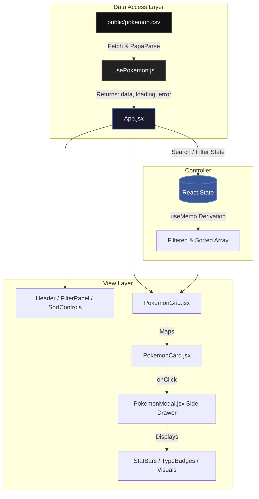

<div align="center">

# 🌌 Premium Pokédex App

[](https://reactjs.org/)
[](https://vitejs.dev/)
[](https://tailwindcss.com/)
[](https://opensource.org/licenses/MIT)

An enterprise-grade, high-performance Pokédex application featuring an "OLED true-black" aesthetic, dynamic 3D micro-interactions, and seamless data visualization.

[Explore Features](#-core-features) • [Installation](#-getting-started) • [Architecture](#-architecture--data-flow) • [Contributing](#-contributing)

</div>

---

## 📖 Overview

This project is a modern, highly optimized Pokédex built to showcase advanced UI/UX patterns in React. It leverages **Vite** for lightning-fast module replacement, **Tailwind CSS v4** for utility-first responsive styling, and **PapaParse** for rapid client-side CSV data ingestion. 

Designed with high-end, stealth aesthetics in mind, the application moves away from standard data grids and provides an immersive catalog experience utilizing layered interactions and complex state algorithms.

## ✨ Core Features

- **OLED True-Black Aesthetics:** Deep `#000` backgrounds with visually striking radial gradients mapped dynamically to Pokémon elemental typings.
- **Immersive 3D Pop-out Cards:** Sprites extend past their glassmorphic grid containers with depth, offering an interactive, tactile feel on hover.
- **Advanced Data Visualization:** Statistical breakdowns using refined UI components, including dynamic stat bars, type effectiveness trackers, and advanced charts.
- **High-Performance Filtering Engine:** Instantaneous client-side filtering via `useMemo` (by generation, type, and legendary status) and rapid sorting algorithms handling heavy datasets with zero jank.
- **Responsive Side-Drawer Elements:** A sleek, context-preserving slide-out modal for in-depth data exploration without disrupting the user's scroll position in the main grid.
- **Modular Component Architecture:** Highly decoupled React component structure ensuring simple maintainability and clean prop-drilling patterns.

## 🗺️ Architecture & Data Flow

The application isolates data-fetching from presentation, utilizing an orchestrator (`App.jsx`) to pass derived state down to pure display components.



## 📁 System Structure

```text
src/
├── components/          # Reusable display components
│   ├── FilterPanel.jsx  # Toggle states for typing and generation
│   ├── PokemonCard.jsx  # Interactive 3D grid items
│   ├── PokemonGrid.jsx  # Responsive layout wrapper
│   ├── PokemonModal.jsx # Detail-view side-drawer overlay
│   ├── SearchBar.jsx    # Fuzzy-search input
│   ├── SortControls.jsx # Multi-parameter sorting rules
│   ├── StatBar.jsx      # Visual meters for base stats
│   └── TypeBadge.jsx    # Themed elemental flags
├── data/
│   └── usePokemon.js    # Custom Hook for async CSV parsing
├── utils/
│   └── typeColors.js    # Design tokens and asset locators
├── App.jsx              # Main Controller & Layout Root
├── index.css            # Global CSS / Output directives
└── main.jsx             # Application Entry Point
```

## 🚀 Getting Started

### Prerequisites

- [Node.js](https://nodejs.org/) (v18.0.0 or higher recommended)

### Installation

1. **Clone the repository:**
   ```bash
   git clone https://github.com/abhrajyoti-01/Pokedex-App.git
   cd Pokedex-App
   ```

2. **Install dependencies:**
   ```bash
   npm install
   ```

3. **Start the development server:**
   ```bash
   npm run dev
   ```

## 🤝 Contributing

Contributions, issues, and feature requests are highly welcome! 
Feel free to check the [issues page](https://github.com/abhrajyoti-01/Pokedex-App/issues) if you want to contribute to the codebase.

## 📄 License

[MIT License](https://opensource.org/licenses/MIT) - Free to use, modify, and distribute.