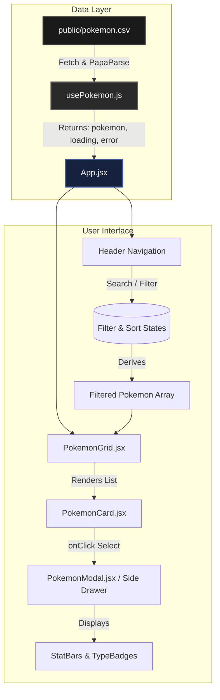

# 🌌 Premium Pokédex App

A modern, high-end "OLED true-black" Pokédex built with React, Vite, and Tailwind CSS. Featuring 3D layered Pokémon cards, a sleek side-drawer detail view, and advanced filtering capabilities.

## ✨ Features
- **OLED True-Black Aesthetics:** Deep `#000` backgrounds with gorgeous radial gradients based on Pokémon types.
- **3D Pop-out Cards:** Sprites extend past their grid containers for a dynamic, interactive feel.
- **Refined Side-Drawer:** A smooth, full-height side-drawer for in-depth stat viewing.
- **Advanced Filtering & Sorting:** Search by name, filter by type, legendary status, or generation, and sort dynamically.

## 🚀 Tech Stack
- **Framework:** React + Vite
- **Styling:** Tailwind CSS (v4)
- **Data Parsing:** PapaParse (CSV integration)

## 🗺️ Application Architecture & Data Flow



## 📦 Installation & Setup

1. **Install dependencies:**
   ```bash
   npm install
   ```
2. **Run the development server:**
   ```bash
   npm run dev
   ```

## 🔮 Future Roadmap
Check out the `design_plan.md` for our upcoming next-gen features including Team Builders, Gyroscopic 3D Tilt Cards, and Interactive Radar Charts!